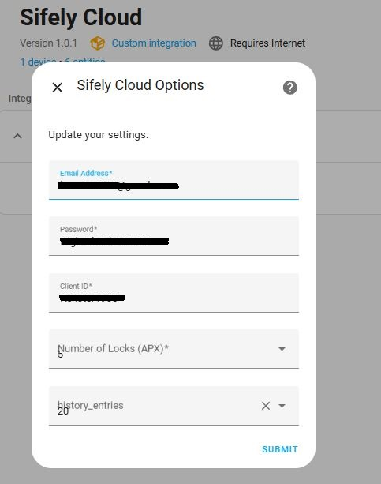
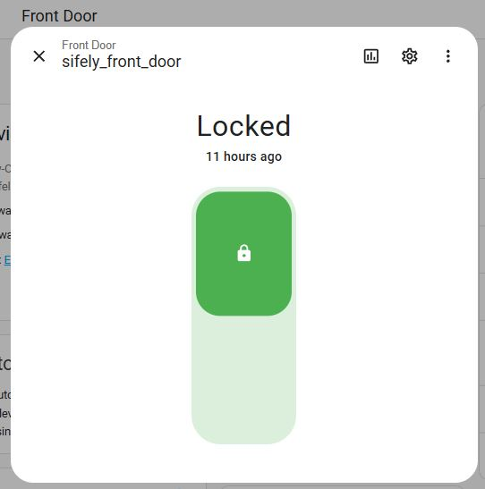
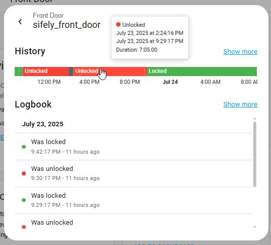
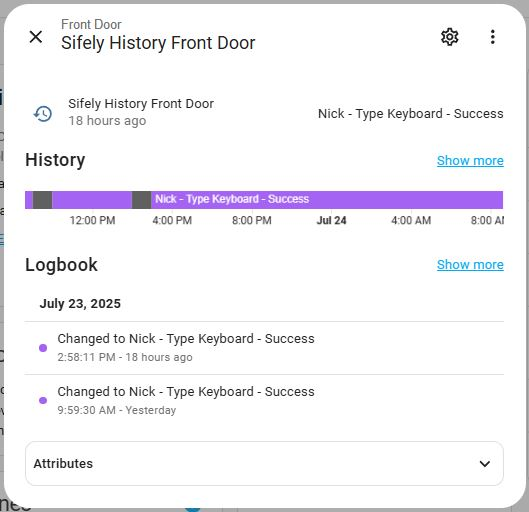
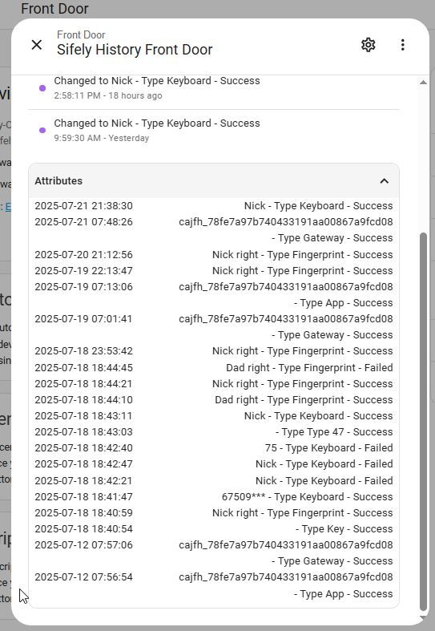

# 🏠 Sifely Cloud - Home Assistant Integration

A **custom integration** for Home Assistant that connects to **Sifely smart locks** using the official Sifely Cloud API. Provides real-time visibility and control over your locks, with enhanced diagnostic and history features.

 

- [API Documentation](#-api-documentation)
- [Features](#-features)
- [UI Screenshots](#-ui-screenshots)
- [Installation](#-installation)
- [Configuration Options](#-configuration-options)
- [Developer Configuration via `const.py`](#-developer-configuration-via-constpy)
- [Entities Created](#-entities-created)
- [File Persistence](#-file-persistence)
- [Roadmap](#-roadmap)
- [Contributing / Issues](#-contributing--issues)
- [Disclaimer](#-disclaimer)
- [License](#-license)
  
## 📚 API Documentation
All Sifely Cloud API endpoints used in this integration are based on the official documentation:
[https://apidocs.sifely.com](https://apidocs.sifely.com)

This includes authentication, lock control, history querying, and diagnostics.

---

## 📦 Features
- 🔐 **Lock/Unlock support**
- 🔋 **Battery level monitoring**
- 📖 **Historical event logging** (username, method, success/fail)
- 🚨 **Cloud error diagnostics**
- 🧠 **Open/closed state polling**
- 👁 **Privacy Lock** and **Tamper Alert** binary sensors
- 💾 **Persisted history** with CSV logging
- 🕓 **Automatic background polling** (every 5 minutes for history)
- 🧰 Compatible with **Entity Category Diagnostics** for advanced insights

---

## 🖼️ UI Screenshots
Below are examples of how entities appear in the Home Assistant UI. These include:

- Integration setup screen  
  

- Lock Control, Battery, Privacy Lock, Tamper Alert sensors, ...  
    
  
  

- Lock history sensor with structured entries  
  
  

---

## 🔧 Installation
### Manual Installation
1. Using the tool of choice open the directory (folder) for your HA configuration (where you find configuration.yaml).
2. If you do not have a custom_components directory (folder) there, you need to create it.
3. In the custom_components directory (folder) create a new folder called `sifely_cloud`.
4. Download all the files from the `custom_components/sifely_cloud/` directory (folder) in this repository.
5. Place the files you downloaded in the new directory (`sifely_cloud`) you created.
6. Restart Home Assistant.
7. Navigate to **Settings > Devices & Services > Integrations**.
   Click ➕ Add Integration → Search for **Sifely Cloud**.
8. Enter your credentials per Configuration Options below.

---

## 🛠 Configuration Options
- **Email / Password** – Your Sifely cloud account credentials
- **Client ID** – A unique identifier used to access the Sifely API
  - 📌 How to obtain your Client ID:
  - Go to the Sifely Smart Manager Portal [https://app-smart-manager.sifely.com/Login.html](https://app-smart-manager.sifely.com/Login.html)
  - Log in using your Sifely app username and password
  - After loging in you will be shown your clientId (What you need) and a clientSecret (not needed)
- **Number of Locks (APX)** – Approximate number of locks to query
- **Number of History Entries** – Maximum recent events to retain (default: `20`)

---

## 🛠 Developer Configuration via `const.py`
Advanced users and developers can override default settings by editing the `const.py` file directly. This includes:
- Polling intervals (e.g. history updates every 5 minutes)
- Maximum number of retries
- History record type labels
- Default limits for entities and diagnostics
- Error thresholds before token refresh

---

## 🧪 Entities Created
| Entity Type     | Description                             |
|-----------------|-----------------------------------------|
| `lock`          | Lock/unlock control for each Sifely lock |
| `sensor`        | Battery sensor + recent history text     |
| `binary_sensor` | Privacy Lock & Tamper Alert flags        |
| `sensor`        | Cloud error diagnostics                  |

---

## 📁 File Persistence
- Historical records are saved to:

`config/custom_components/sifely_cloud/history/history_<lockId>.csv`

- Only *new* records are appended; existing entries are deduplicated based on `recordId`.

---

## 🚧 Roadmap
See the [ROADMAP.md](./ROADMAP.md) for upcoming features and ideas.

--- 

## 🧑‍💻 Contributing / Issues
Got a feature request, bug report, or enhancement idea?

- Found a bug or want a new feature? [Open an issue](https://github.com/kenster1965/sifely_cloud/issues)
- Pull requests are welcome and encouraged!
- Follow Home Assistant [developer documentation](https://developers.home-assistant.io/) when contributing code

---

## 📜 Disclaimer
This is an independent project and is **not affiliated with Sifely**. Use at your own risk. API behavior may change without notice.

---

## 📄 License
[MIT License](LICENSE)

---

